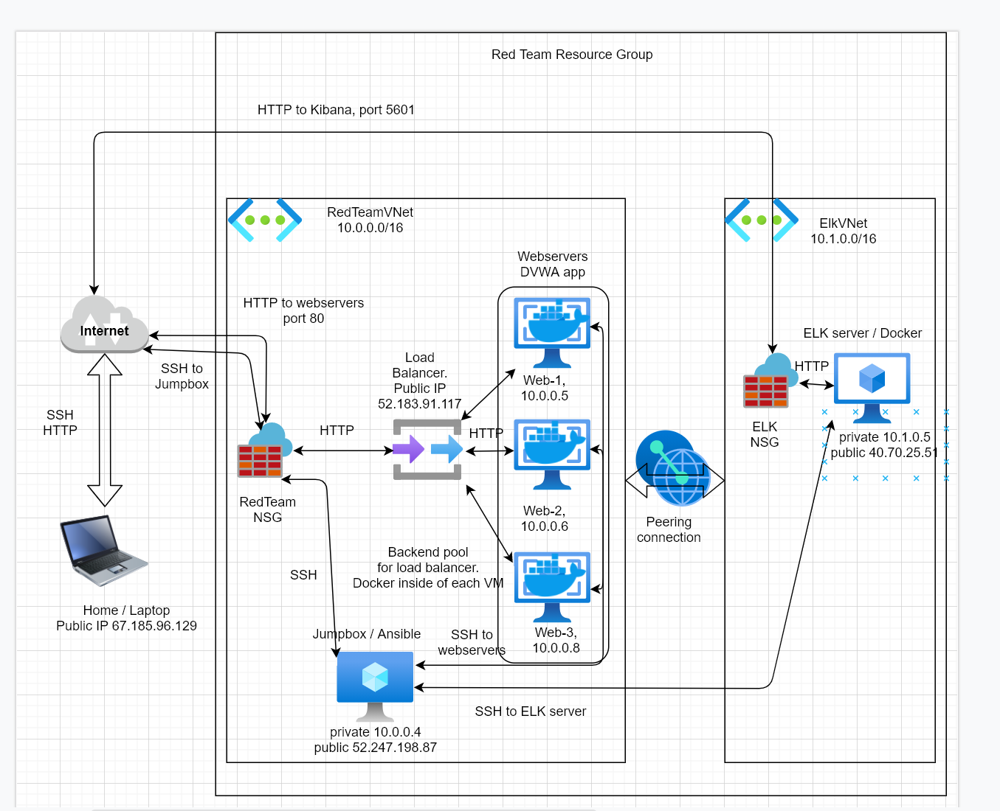

#### How to create the network

- Microsoft Azure has the trial account with some free credit used to pay for the resources

- [Jumpbox](https://en.wikipedia.org/wiki/Jump_server) is the machine for accessing the network and to configure other machines. It is the only point of entry to the network.

- There are 3 web servers in the same location zone.

- There is an [ELK stack](https://www.elastic.co/what-is/elk-stack) server in another location zone, as the basic Microsoft Azure account allows only 4 processors per zone. These are occupied by 3 webservers and 1 jumpbox.

- Jumpbox controls every other machine by [Ansible](https://www.ansible.com/) to deliver the [Infrastructure As Code](https://en.wikipedia.org/wiki/Infrastructure_as_code) approach.

- All Azure machines belong to the same Resource Group, as they represent the separate eco-system, even if it's distributed across multiple zones.

# Step-by-step guide for the network creation

- Create a [Resource Group](https://portal.azure.com/#create/Microsoft.ResourceGroup)
  - Select your subscription
  - Add name: *RedTeamResourceGroup*
  - Select the location closest to you: *(US) West US 2*
  - Leave tags empty

- Create a [network](https://portal.azure.com/#create/Microsoft.VirtualNetwork) for the Jumpbox and WebServers
  - Select your subscription and ResourceGroup
  - Add name: *RedTeamVNet*
  - Leave all other settings as default

- Create another network named *ELKVnet* for ELK server

- Add a peering between these networks:
  - Select *RedTeamVNet*
  - Click "Peerings"
  - Click "Add"
  - Allow all traffic between *ELKVnet* and *RedTeamVNet*

- Create a [Network Security Group](https://portal.azure.com/#create/Microsoft.NetworkSecurityGroup)
  - Select your subscription
  - Add name: *RedTeamNetworkSecurityGroup*
  - Select the location same as the Resource Group
  - Leave tags empty

- Create another Network Security Group
  - Name would be *ElkSecurityGroup*

- Add a virtual machine for the Jumpbox
  - Machine type should be **Standard - B1s** - Jumpbox does not need to be powerful
  - OS for this and other machines should be **Ubuntu Server 18.04 LTS - Gen 1**
  - This machine should have a public IP address
  - No availability set required
  - Add network security group *RedTeamNetworkSecurityGroup*
  - Auth is by SSH key: public part goes to Jumpbox, private stays at your local machine
  - Username should be easy to remember, for instance, *azdmin*
  
- Add a rule for SSH connection from your local machine to the jumpbox
  - It's configured at NetworkSecurityGroup, Inbound rule. Source is your local machine ip (https://whatismyipaddress.com/), destination is Network. SSH is port 22.
  - Verify the connection by using `ssh admin-username@VM-public-IP` and sudo rights
  - Create SSH keys pair - it will be used at other machines
  
- Add machines for webservers
  - Name the machines "Web-1", "Web-2", "Web-3"
  - The machine type should be **Standard B1ms (1 vcpus, 2 GiB memory)**
  - The user name should be different from Jumpbox: use *sysadmin*
  - The machines should have an availability set: create it as well
  - SSH key for connection is that one from Jumpbox

- Add the webservers to the load balancer
  
- Add machine for ELK server
  - It should be in the separate location and separate Network Security Group
  - It should have a public IP
  - It should be type **Standard D2s v3 (2 vcpus, 8 GiB memory)**
  
- Open the ports for accessing the machines at appropriate Network Security Group
  - Port 80 for webservers
  - Ports 80 and 5601 for ELK server
  
- Install and use Ansible at Docker container of Jumpbox
  - SSH to Jumpbox
  - `sudo apt update`
  - `sudo apt install docker.io`
  - `sudo docker pull cyberxsecurity/ansible`
  - Connect to the docker container
  - Add the config files and playbooks from **ansible** folder to the Docker container
  - Edit the playbooks (IP addresses of the machines) if necessary
  - Run the playbooks
  
# Final
Now you should have the network like this 